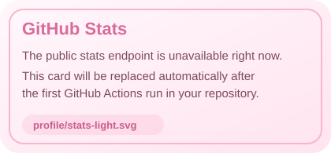
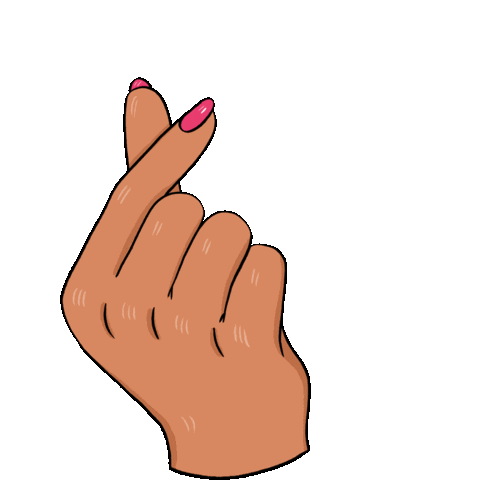

  

<table align="center">
  <tr>
    <td width="56%" valign="top">
      <h3>💅🏻 About me</h3>
      <ul>
        <li>💼 I'm currently working at <a href="https://www.a2solutions.com.br/">A2 Solutions</a>.</li>
        <li>🎓 I hold a degree in Systems Analysis and Development.</li>
        <li>📝 I write about technology and development in Portuguese on my <a href="#">personal blog</a>.</li>
        <li>📚 You can explore my projects on my <a href="#">portfolio website</a>.</li>
      </ul>
    </td>
    <td width="44%" align="center" valign="top">
      <h3>📈 GitHub stats</h3>
      <picture>
        <source media="(prefers-color-scheme: dark)" srcset="./profile/stats-dark.svg">
        <source media="(prefers-color-scheme: light)" srcset="./profile/stats-light.svg">
        
      </picture>
    </td>
  </tr>
</table>

  <h2>🎀 Languages and Tools</h2>
  

    
    
    
    
    
    
    
    
  

  

  <h3>💗 Socials</h3>
  
  
  

  

  

